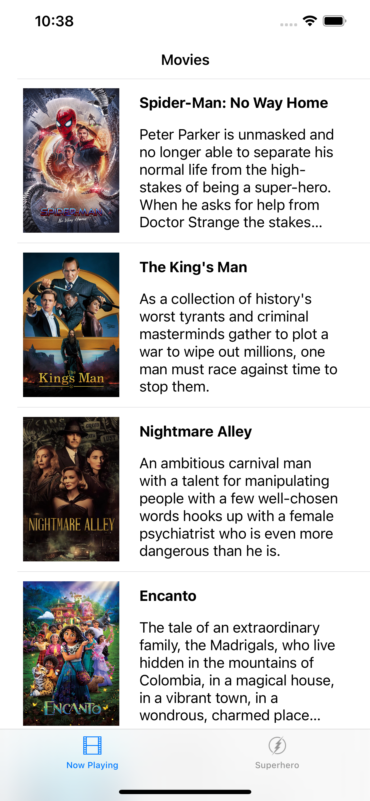
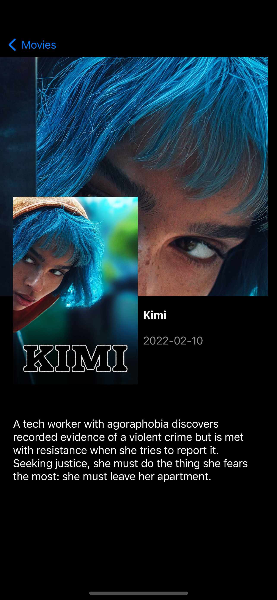
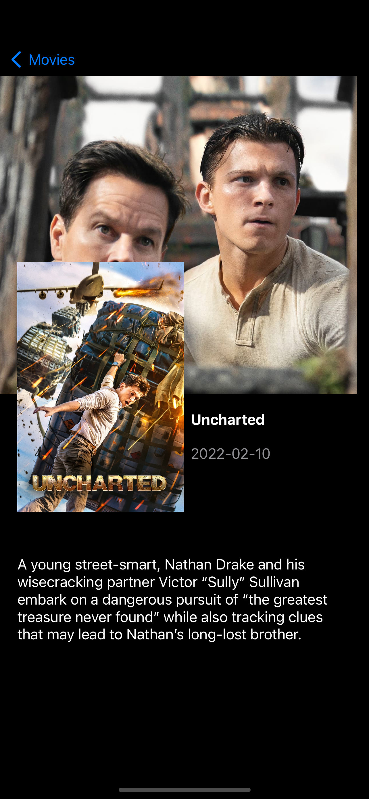
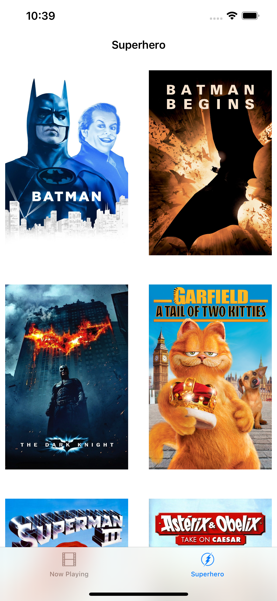
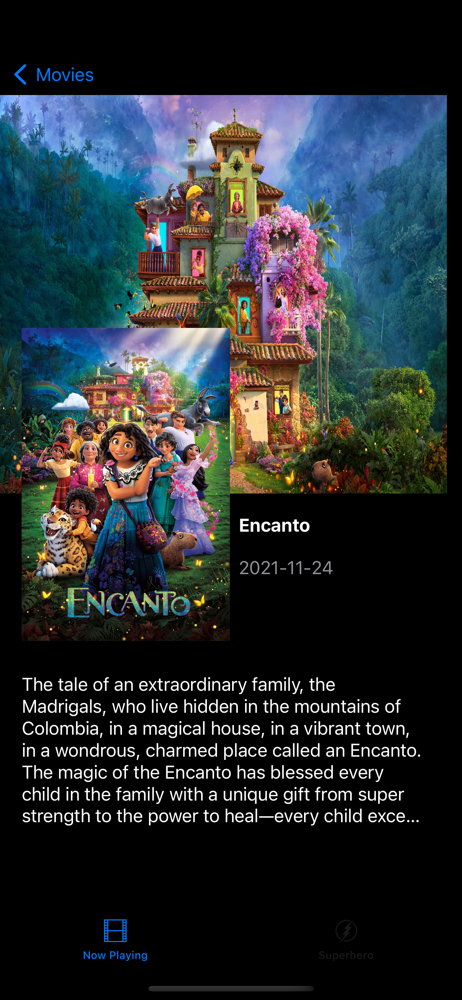

# F L I X T E R

Flix is an app that allows users to browse movies from the [The Movie Database API](http://docs.themoviedb.apiary.io/#).

## Flix Part 1

### User Stories

`TODO://`

#### REQUIRED (10pts)

- [ X ] (2pts) User sees an app icon on the home screen and a styled launch screen.
- [ X ] (5pts) User can view and scroll through a list of movies now playing in theaters.
- [ X ] (3pts) User can view the movie poster image for each movie.

#### BONUS

- [ X ] (2pt) User can view the app on various device sizes and orientations.
- [ X ] (1pt) Run your app on a real device.

#### REQUIRED (10pts)

- [ X ] (5pts) User can tap a cell to see more details about a particular movie.
- [ X ] (5pts) User can tap a tab bar button to view a grid layout of Movie Posters using a CollectionView.

### App Walkthrough GIF

 

`TODO://`

  
  
   
    
     
      
 

